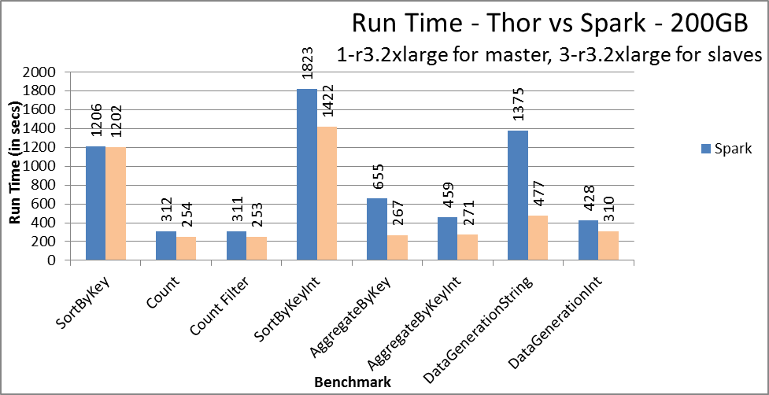

# 1 Introduction

In the past, there have been papers that discussed the performance of Apache Spark[<sup>1</sup>](#f1). But, no paper has compared the Apache Spark’s performance to the HPCC Systems Thor cluster[<sup>2</sup>](#f2) performance.

When we first became interested in comparing a Thor cluster to an Apache Spark cluster we started to look at the performance of a Thor cluster when executing the Gray Sort. Why? Because a Spark cluster had won the 2014 Gray Sort competition where 100 TBs of data where sorted using 206 AWS i2.8xlarge instance types[<sup>1</sup>](#f1). We abandoned this effort because of the expense of 206 i2.8xlarge instance types (currently $6.820 per instance per hour or $1,404.92 per hour for 206 instances)[<sup>3</sup>](#f3).

We decided to host both Thor and Apache Spark clusters on a small number of lower cost AWS instance types. We felt this would be a good test for two reasons: 1) the lower cost made it possible to do the experiments, and 2) most often those interested in using a data cluster like Thor or Apache Spark would use a smaller number of instances and if they used AWS they would probably use a less expensive instance type. Also, we decided to test the performance of both clusters on a variety of different functions because it would give the reader a better feel for what computation each cluster type performed best. <span id="_Toc492896163" class="anchor"></span>

# 2 Cluster Specifications

Both the Thor and Spark clusters were created on AWS with one r3.2xlarge instance type for the master and 3 r3.2xlarge instance types for slaves. The r3.2xlarge instance type has 8 cores, 61 GiB RAM, and 160 GB SSD storage.

## 2.1 Thor

A parameter that was set on the Thor cluster is the number of slave nodes per instance, i.e. slavesPerNode. This parameter determines 1) how many file parts exists on each instance, e.g. if there are 16 slave nodes per instance then each logical file will have 16 parts on each instance, and 2) the number of virtual slave nodes on each slave instance.

We tried three different settings for slavesPerNode, 4, 8, and 16. We got the fastest execution times with slavesPerNode set to 16. The execution times shown in this paper are for slavesPerNode set to 16.

## 2.2 Spark

There are three parameters we have considered while tuning the performance of Spark: number of executors, executor core, and executor memory. We found the fastest execution times with executors as 24, executor core as 1 and executor memory is 7000MB.

# 3 Experimental Methodology

The functions executed by both the Thor and Apache Spark clusters were selected for two reasons: 1) both have these functions as fundamental operations (for HPCC Systems in the ECL language and for Spark in the Scala language); and 2) others (specifically DataBricks) have used the same functions studying the performance of the Apache Spark cluster[<sup>4</sup>](#f4).

## 3.1 Data Generation

In this work, we have tried to emulate the standard practice of benchmarking followed by other works. Benchmark’s requiring integer data were run with 6.25 billion records for the 100 GB dataset and 12.5 billion for 200 GB dataset. Benchmark’s requiring string data were run with 1 billion records for the 100 GB dataset and 2 billion for the 200 GB. A record of string data has 10 bytes for the key field and 90 bytes for the fill field; while, a record of integer data has 8 bytes for the key field and 8 bytes for the fill field (total of 16 bytes).

For the data, we chose two sizes: 100 GB and 200 GB. These sizes were chosen because 100GB when partitioned (distributed) to the three slave instances would fit in RAM (61 GiB of RAM per instance). Further, 200 GB was selected because it would not fit in RAM.

## 3.2 Benchmarking Functions

### ***3.2.1 Aggregate by String Key***


### ***3.2.2 Aggregate by Integer Key***


### ***3.2.3 Count***


### ***3.2.4 Count with Filter***


### ***Sort by String Key***


### ***3.2.6 Sort by Integer Key***


# 4 Results: Comparison of Thor to Apache Spark

Below are the bar charts comparing execution times for each benchmark function executed on both Apache Spark and Thor. In section 4.1 and section 4.2 there are two bar charts that compare Apache Spark to Thor. The first bar chart compares execution times when the size of the data is 100GB; while, the second compares execution times when the size of the data is 200 GB. In each bar chart, there are 2 bars: one for Spark (**blue bars**), and one for Thor (**tan bars**).

### 4.1 Bar Charts Comparing Execution Times When Data was 100GB 


### 4.2 Bar Charts Comparing Execution Times When Data was 200GB 



## 4.3 Speedup Bar Charts

In this section, there are two bar graphs showing the speedup where the speedup calculation is: Spark’s execution time over Thor’s execution time. The first graph shows the speedup when the input dataset size is 100GB. The second shows the speedup when the input dataset size is 200 GB.

Any speedup above 1.0 means Thor had a better execution time; speedups below 1.0 means Spark had a better execution (1.0 is indicated by the **red line**).

### 4.3.1 Analysis of Speedups for 100 GB dataset

Spark had a better average execution time for SortByKey. For Count, Count Filter and SortByKeyInt both clusters had similar average execution times. And, for AggregateByKey, AggregateByKeyInt, DataGenerationString and DataGenerationInt Thor had better average execution times where AggregateByKey had the largest speedup.

### 4.3.2 Analysis of Speedups for 200 GB Dataset

For SortByKey, both clusters had similar average execution times. For all other benchmark functions, Thor had better average execution times where, again, AggregateByKey had the largest speedup.

### Charts 4.3. Speedups for Execution Times


# Appendix A. ECL Code for HPCC Systems

Below is the ECL code that executes the benchmark functions. You will notice that the last statement of each function is an OUTPUT statement that outputs the COUNT, i.e. the number of records in the resulting dataset. The main purpose for this statement is to cause the execution of the code. Why? Because statements of an ECL program do NOT execute until an “action” statement is encounter. The OUTPUT statement is our “action” statement.

We have also added a statement that one would normally not use, the NOFOLD statement. Why? When doing a COUNT after a SORT, the code generator realizes that the SORT does not need to be done since the code only outputs the COUNT. So, no code is generated for the SORT since the COUNT of the sorted dataset is the same as the COUNT for the original unsorted dataset. The NOFOLD statement causes the SORT to be performed.

In general, the NOFOLD statement causes the code that is generated to be unoptimized.

## A.1 ***BWR\_AggregateByKey.ecl***

```
#WORKUNIT('name', 'AggregateByKey');
unique_keys := 100000;
unique_values := 10212;
dataset_name := '~benchmark::string';
rs := {integer key, integer fill};
rs_str := {string10 key, string90 fill};
outdata := DATASET(dataset_name, rs_str, THOR);
outdata1 := project(outdata, transform(rs, self.fill:=ABS((integer)left.fill); self:=left));
outdata2 := table(outdata1, {key, sum(group, fill)}, key, FEW);
OUTPUT(COUNT(NOFOLD(outdata2)));
```

## A.2 ***BWR\_AggregateByKeyInt.ecl***

```
#WORKUNIT('name', 'AggregateByKeyInt');
dataset_name := '~benchmark::integer';
rs := {integer key, integer fill};
outdata := DATASET(dataset_name, rs, THOR);
outdata1 := table(outdata, {key, sum(group, fill)}, key, FEW);
OUTPUT(COUNT(NOFOLD(outdata1)));
```

## ***A.3 BWR\_Count.ecl***

```
#WORKUNIT('name', 'Count');
dataset_name := '~benchmark::integer';
rs := {integer key, integer fill};
outdata := DATASET(dataset_name, rs, THOR);
OUTPUT(COUNT(NOFOLD(outdata)));
```

## ***A.4 BWR\_CountWithFilter.ecl***

```
#WORKUNIT('name', 'CountWithFilter');
dataset_name := '~benchmark::integer';
rs := {integer key, integer fill};
outdata := DATASET(dataset_name, rs, THOR);
OUTPUT(COUNT(NOFOLD(outdata(fill%2=1))));
```

## A.5 ***BWR\_DataGenerationInteger.ecl***

```
#WORKUNIT('name', 'DataGenerationInteger');
IMPORT STD;
unique_keys := 100000;
unique_values := 10212;
dataset_name := '~benchmark::integer';
totalrecs := 12500000000;
unsigned8 numrecs := totalrecs/CLUSTERSIZE;
rec := {integer key, integer fill};
outdata := DATASET(totalrecs, transform(rec, self.key := random() % unique\_keys; self.fill := random() % unique\_values;), DISTRIBUTED);

IF( not STD.File.FileExists(dataset_name)
,OUTPUT(outdata,,dataset\_name)
,OUTPUT('Dataset '+dataset_name+' ALREADY EXISTS.')
);
```

## A.6 ***BWR\_DataGenerationString.ecl***

```
#WORKUNIT('name', 'DataGenerationString');
IMPORT STD;
dataset_name := '~benchmark::string';
totalrecs := 2000000000;
unsigned8 numrecs := totalrecs/CLUSTERSIZE;
rec := {string10 key, string90 fill};
unique_keys := 100000;
unique_values := 10212;
STRING10 gen_key() := INTFORMAT(RANDOM()%unique_keys,10,1);
STRING10 gen_fill() := INTFORMAT(RANDOM()%unique_values,90,1);
outdata := DATASET(totalrecs, transform(rec, self.key := gen_key(), self.fill := gen_fill()), DISTRIBUTED);
OUTPUT(outdata,,dataset\_name,overwrite);
```

## A.7 ***BWR\_SortByKey.ecl***

```
#WORKUNIT('name', 'SortByKey');
dataset_name := '~benchmark::string';
rs_str := {string10 key, string90 fill};
outdata := DATASET(dataset_name, rs_str, THOR);
outdata1 := sort(outdata, key);
OUTPUT(COUNT(NOFOLD(outdata1)));
```

## A.8 ***BWR\_SortByKeyInt.ecl***

```
#WORKUNIT('name', 'SortByKeyInt');
dataset_name := '~benchmark::integer';
rs := {integer key, integer fill};
outdata := DATASET(dataset_name, rs, THOR);
outdata1 := sort(outdata, key);
OUTPUT(COUNT(NOFOLD(outdata1)));
```

# Appendix B. Code for Spark (Scala)

Below, first find the scala object DataGenerator which includes the code to generate both the string and integer data. After the DataGenerator is the scala code for the six benchmark functions.

```
object DataGenerator {

  // Port of Guava goodFastHash
  def goodFastHash(startSeed: Long, minimumBits: Int, valToHash: Long): String = {
    val bits: Int = (minimumBits + 31) & ~31

    val hash : String = ""
    if (bits <= 128) {
      val hashFunc = Hashing.murmur3_128(startSeed.toInt)
      hash.concat(hashFunc.hashLong(valToHash).toString)
    } else {

      // Join some 128-bit murmur3s
      val hashFunctionsNeeded: Int = (bits + 127) / 128
      var seed: Long = startSeed; 
      for (i <- 0 until hashFunctionsNeeded) {
        val hashFunc = Hashing.murmur3_128(seed.toInt)
        hash.concat(hashFunc.hashLong(valToHash).toString)
        // a prime; shouldn't matter
        seed += 1500450271
      }

    }

    hash
  }

  /** Encode the provided integer as a fixed-length string. If a hash function is provided,
    * the integer is hashed then encoded. */
  def paddedString(i: Long, length: Int, hashFunction: Option[(Long,Int)] = None): String = {
    hashFunction match {
      case Some(hashParams) =>
        val hash = goodFastHash(hashParams._1,hashParams._2,i)
        val out = hash.take(length)
        require(out.length == length, s"Hash code was too short for requested length: $length")
        out
      case None =>
        val fmtString = "%%0%sd".format(length)
        fmtString.format(i)
    }
  }

  /** Creates a key-value int dataset but does not cache it, allowing for subsequent processing */
  private def generateIntData(
      sc: SparkContext,
      numRecords: Long,
      uniqueKeys: Int,
      uniqueValues: Int,
      numPartitions: Int,
      randomSeed: Int)
    : RDD[(Long, Long)] =
  {
    val recordsPerPartition = (numRecords / numPartitions.toDouble).toInt

    def generatePartition(index: Int) = {
      // Use per-partition seeds to avoid having identical data at all partitions
      val effectiveSeed = (randomSeed ^ index).toString.hashCode
      val r = new Random(effectiveSeed)
      (1 to recordsPerPartition).map{i =>
        val key : Long = r.nextInt(uniqueKeys)
        val value : Long = r.nextInt(uniqueValues)
        (key, value)
      }.iterator
    }

    sc.parallelize(Seq[Int](), numPartitions).mapPartitionsWithIndex{case (index, n) => {
      generatePartition(index)
    }}
  }

  /** Creates and materializes a (K, V) int dataset according to the supplied parameters. */
  def createKVIntDataSet(
      sc: SparkContext,
      numRecords: Long,
      uniqueKeys: Int,
      uniqueValues: Int,
      numPartitions: Int,
      randomSeed: Int,
      persistenceType: String,
      storageLocation: String = "/tmp/spark-perf-kv-data")
    : RDD[(Long, Long)] =
  {
    val inputRDD = generateIntData(
      sc, numRecords, uniqueKeys, uniqueValues, numPartitions, randomSeed)

    val rdd = persistenceType match {
      case "memory" => {
        val tmp = inputRDD.persist(StorageLevel.MEMORY_ONLY)
        tmp.count()
        tmp
      }
      case "memory_and_disk_ser" => {
        val tmp = inputRDD.persist(StorageLevel.MEMORY_AND_DISK_SER)
        tmp.count()
        tmp
      }
      case "memory_ser" => {
        val tmp = inputRDD.persist(StorageLevel.MEMORY_ONLY_SER)
        tmp.count()
        tmp
      }
      case "disk" => {
        val tmp = inputRDD.persist(StorageLevel.DISK_ONLY)
        tmp.count()
        tmp
      }
      case "hdfs" => {
        val storagePath = new Path(storageLocation)
        val fileSystem = storagePath.getFileSystem(new Configuration())
        if (!fileSystem.exists(storagePath)) {
          inputRDD.map{case (k, v) => "%s\t%s".format(k, v)}
                  .saveAsTextFile(storageLocation, classOf[DefaultCodec])
        } else {
          println(s"ATTENTION: Using input data already stored in $storageLocation. " +
            s"It is not guaranteed to be consistent with provided parameters.")
        }
        sc.textFile(storageLocation).map(_.split("\t")).map(x => (x(0).toLong, x(1).toLong))
      }
      case unknown => {
        throw new Exception(s"Unrecognized persistence option: $unknown")
      }
    }
    rdd
  }

  /** Creates and materializes a (K, V) string dataset according to the supplied parameters. */
  def createKVStringDataSet(
      sc: SparkContext,
      numRecords: Long,
      uniqueKeys: Int,
      keyLength: Int,
      uniqueValues: Int,
      valueLength: Int,
      numPartitions: Int,
      randomSeed: Int,
      persistenceType: String,
      storageLocation: String = "/tmp/spark-perf-kv-data",
      hashFunction: Option[(Long,Int)] = None)
    : RDD[(String, String)] =
  {
    val ints = generateIntData(
      sc, numRecords, uniqueKeys, uniqueValues, numPartitions, randomSeed)
    val inputRDD = ints.map { case (k, v) =>
      (paddedString(k, keyLength, hashFunction), paddedString(v, valueLength, hashFunction))
    }

    val rdd = persistenceType match {
      case "memory" => {
        val tmp = inputRDD.persist(StorageLevel.MEMORY_ONLY)
        tmp.count()
        tmp
      }
      case "memory_and_disk_ser" => {
        val tmp = inputRDD.persist(StorageLevel.MEMORY_AND_DISK_SER)
        tmp.count()
        tmp
      }
      case "memory_ser" => {
        val tmp = inputRDD.persist(StorageLevel.MEMORY_ONLY_SER)
        tmp.count()
        tmp
      }
      case "disk" => {
        val tmp = inputRDD.persist(StorageLevel.DISK_ONLY)
        tmp.count()
        tmp
      }
      case "hdfs" => {
        val storagePath = new Path(storageLocation)
        val fileSystem = storagePath.getFileSystem(new Configuration())
        val pathExists = fileSystem.exists(storagePath) && fileSystem.listStatus(storagePath).length > 0
        if (!pathExists) {
          inputRDD.map{case (k, v) => "%s\t%s".format(k, v)}
            .saveAsTextFile(storageLocation, classOf[DefaultCodec])
        } else {
          println(s"ATTENTION: Using input data already stored in $storageLocation. " +
            s"It is not guaranteed to be consistent with provided parameters.")
        }
        sc.textFile(storageLocation).map(_.split("\t")).map(x => (x(0), x(1)))
      }
      case unknown => {
        throw new Exception(s"Unrecognized persistence option: $unknown")
      }
    }
    rdd
  }
}


class AggregateByKey(sc: SparkContext) extends KVDataTest(sc) {
  override def runTest(rdd: RDD[_], reduceTasks: Int) {
    rdd.asInstanceOf[RDD[(String, String)]]
      .map{case (k, v) => (k, v.toInt)}.reduceByKey(_ + _, reduceTasks).count()
  }
}

class AggregateByKeyInt(sc: SparkContext) extends KVDataTest(sc, "int") {
  override def runTest(rdd: RDD[_], reduceTasks: Int) {
    rdd.asInstanceOf[RDD[(Long, Long)]]
      .reduceByKey(_ + _, reduceTasks).count()
  }
}

class SortByKey(sc: SparkContext) extends KVDataTest(sc) {
  override def runTest(rdd: RDD[_], reduceTasks: Int) {
    rdd.asInstanceOf[RDD[(String, String)]]
      .sortByKey(numPartitions=reduceTasks).count()
  }
}

class SortByKeyInt(sc: SparkContext) extends KVDataTest(sc, "int") {
  override def runTest(rdd: RDD[_], reduceTasks: Int) {
    rdd.asInstanceOf[RDD[(Long, Long)]]
      .sortByKey(numPartitions=reduceTasks).count()
  }
}

class Count(sc: SparkContext) extends KVDataTest(sc, "int") {
  override def runTest(rdd: RDD[_], reduceTasks: Int) {
    rdd.asInstanceOf[RDD[(Long, Long)]]
      .count()
  }
}

class CountWithFilter(sc: SparkContext) extends KVDataTest(sc, "int") {
  override def runTest(rdd: RDD[_], reduceTasks: Int) {
    rdd.asInstanceOf[RDD[(Long, Long)]]
      .filter{case (k, v) => k.toInt % 2 == 1}.count()
  }
}

```

## Footnotes
<a name="f1">
   </a>

[1] [https://spark.apache.org/news/spark-wins-daytona-gray-sort-100tb-benchmark.html](../customXml/item1.xml)

[https://link.springer.com/chapter/10.1007/978-3-319-31409-9\_3](../customXml/item2.xml)

https://www.oreilly.com/ideas/investigating-sparks-performance

<a name="f2">
   </a>

[2] An HPCC Systems can have two different types of clusters – a Thor and/or ROXIE cluster. A ROXIE cluster, or rapid delivery engine, functions as the engine that delivers answers to queries (e.g. from the web). The function of a Thor cluster is very similar to the function of a Spark cluster. Both are designed to execute big data workflows, including such tasks as extraction, loading, cleansing, transformations, linking and indexing.


<a name="f3">
   </a>

[3] i2.8xlarge instance type is a retired instance type. Today, an equivalent is i3.8xlarge which costs much less, $2.496 per hour.


<a name="f4">
   </a>

[4] [https://github.com/databricks/spark-perf](numbering.xml)
